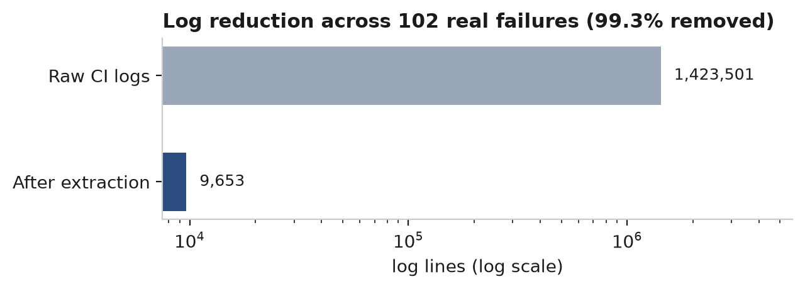
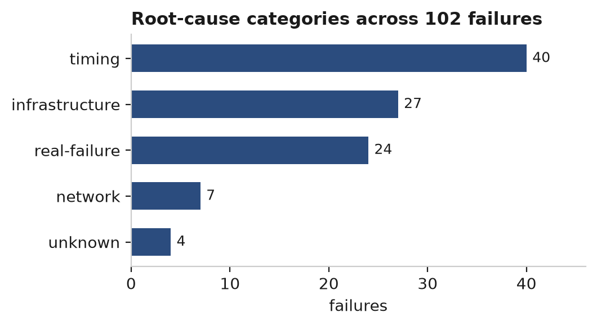

# Podman CI Flake Triage

Automated triage of flaky test failures in Podman's GitHub Actions CI.


## Why

A single failed CI run produces ~28 MB of logs across 56 jobs, of
which 3-4 actually failed. Maintainers read those by hand to work out
whether a red build is a real bug or a flake.

## Results (102 real failures from 57 runs, Aug 2026)

| | |
|---|---|
| Log reduction | 1,423,501 lines to 9,653 (99.3%) |
| Excerpts containing the real failure | 102/102 |
| Failures grouped into error signatures | 102 into 53 |
| LLM agreement with hand labels, prompt v1 | 15% (n=20) |
| LLM agreement with hand labels, prompt v2 | **80%** (n=20) |

Model: `llama3.1:8b`, run locally via Ollama. No API key, no cost,
no log data leaving the machine.

## The 15% -> 80% jump

Prompt v1 collapsed onto two labels (`resource` and `real-failure`),
never emitting the other four, and reported "high" confidence on all
20 - including one case where it invented an out-of-memory kill that
appears nowhere in the log. It scored below a constant-guess baseline
(always answering "timing" scores 50%).

Prompt v2 changed four things: categories got definitions with signals
and exclusions instead of bare words; the model must quote the evidence
line *before* naming a category; "unknown" was declared explicitly
correct when evidence is missing; and truncation was doubled.

Same model, same data, same 20 failures. 15% -> 80%.

The 4 remaining disagreements are all category-boundary cases, not
hallucinations - every v2 answer quotes a real line from the log.

## Tests

```
pip install -r requirements.txt
python3 -m pytest test_signatures.py -v
```

Nine tests covering signature extraction, including the three cases the
pipeline depends on: suite summaries must not outrank named test
failures, bats failures can sit thousands of lines above the end of a
log, and the same flake with different port numbers must collapse to one
signature.

## Charts





## Pipeline

1. `fetch_flakes.py` - pull failed runs, cache log archives locally
2. `extract.py` - find the real failure region in the archive
3. `categorize.py` - regex rules for known patterns (free, instant)
4. `llm_categorize_v2.py` - local LLM for what rules can't match
5. `score.py` - measure agreement against `my_labels.py`

Rules run first by design: the four network failures were caught
correctly by regex, where prompt v1 got 0/4.

## Notable findings

- `##[error]` is the universal failure marker, but a job can have
  several and some steps are allowed to fail. The API's `failed_steps`
  identifies which one matters.
- Test frameworks differ in *where* failures appear: Ginkgo summarises
  at the end, bats prints `not ok` at the moment of failure - possibly
  thousands of lines earlier. Tail-only extraction misses bats entirely.
- Windows machine e2e dominates: all 8 suite timeouts in the sample
  belong to that one job, running 2952s, 2977s and 3007s against a
  3000s limit. A suite-budget problem, not a flaky test.
  A suite-budget problem, not a test bug.
- The same apiv2 exec test failed under both root and rootless in one
  run, expecting `volcontent` and receiving empty output - a clean
  race-condition signature.

See `NOTES.md` for the full working notes, including approaches that
didn't work.
